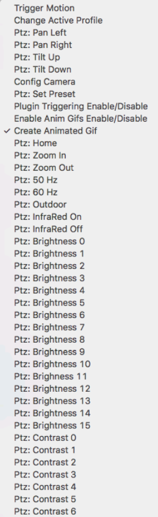
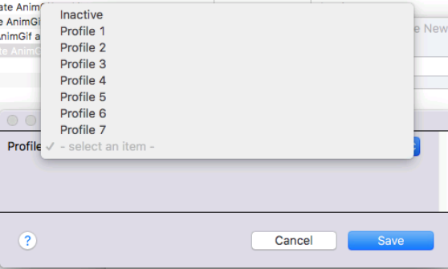
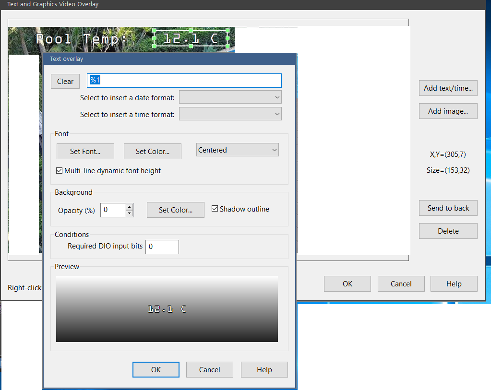
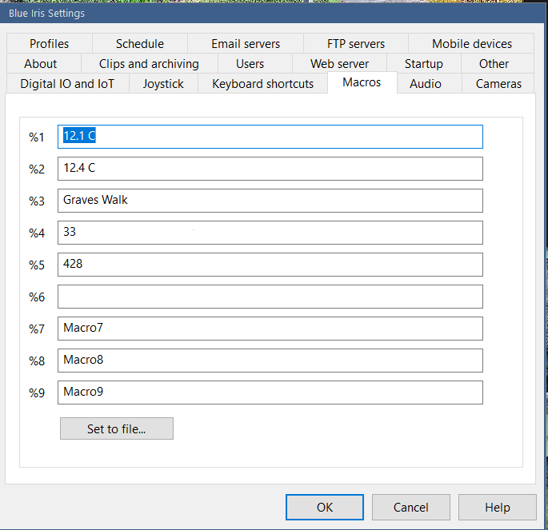
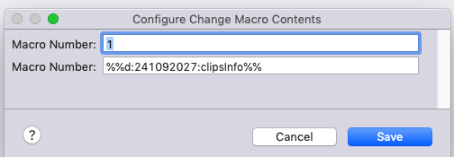
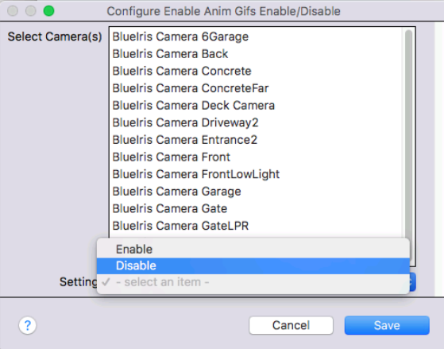
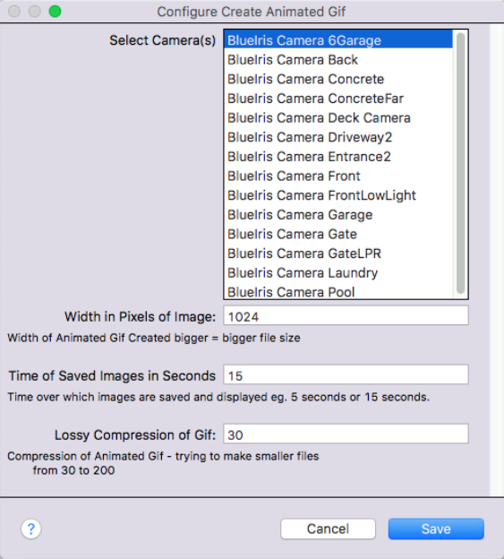

# Actions Reference

All plugin actions appear under **Actions ▸ BlueIris** in Indigo.

---

## Camera Actions (require a BlueIris Camera device)

### Trigger Motion
**ID:** `Trigger`

Manually triggers the selected camera in Blue Iris — equivalent to pressing the camera's "Trigger" button.

---

### Config Camera
**ID:** `camconfig`

Changes camera settings such as motion detection enable/disable, PTZ cycle, pause state, and manual record.

| Option | Description |
|--------|-------------|
| Enable / Disable Motion | Toggle BI motion detection for the camera |
| Enable PTZ Cycle | Start/stop PTZ patrol cycle |
| Pause Camera | Pause / unpause the camera |
| Manual Record | Start / stop manual recording |

---

### Motion Trigger Settings Camera
**ID:** `setmotion`

Adjusts BI motion sensitivity settings for the selected camera.

---

### Download Image for Camera(s)
**ID:** `actionDownloadImage`

Pulls a JPEG snapshot from the selected camera(s) and saves it to `<saveDir>/<cameraShortName>/image.jpg`.

| Option | Description |
|--------|-------------|
| Camera(s) | One or more BlueIris Camera devices |
| Width (px) | Download width (height auto-scaled) |

---

## PTZ Actions (require a BlueIris Camera device)

| Action | ID | Description |
|--------|----|-------------|
| Pan Left | `Left` | PTZ pan left |
| Pan Right | `Right` | PTZ pan right |
| Tilt Up | `Up` | PTZ tilt up |
| Tilt Down | `Down` | PTZ tilt down |
| Home | `Home` | Move to PTZ home position |
| Zoom In | `ZoomIn` | PTZ zoom in |
| Zoom Out | `ZoomOut` | PTZ zoom out |
| Set Preset | `Preset` | Move to a named PTZ preset |
| 50 Hz | `Hz50` | Set 50 Hz flicker reduction |
| 60 Hz | `Hz60` | Set 60 Hz flicker reduction |
| Outdoor | `Outdoor` | Toggle outdoor mode |
| InfraRed On | `IRon` | Enable IR LEDs |
| InfraRed Off | `IRoff` | Disable IR LEDs |
| Brightness 0–4 | `B0`–`B4` | Set camera brightness level |

---

## Server / Global Actions

### Change Active Profile
**ID:** `changeProfile`

Switches the active Blue Iris profile (0 = Away, 1–7 = user-defined).

| Option | Description |
|--------|-------------|
| Profile | Menu: 0–7 |

---

### Change Macro Contents
**ID:** `changeMacro`

Updates the content of a named BI macro (the `~` macros in BI).  Requires an admin account.

BI v5 supports camera overlay macros and server-level macros:

| Option | Description |
|--------|-------------|
| Macro Name | The macro to update (e.g. `~1`) |
| Value | New content (Indigo substitution supported) |

---

### Plugin Triggering Enable/Disable
**ID:** `PluginTriggering`

Enables or disables the plugin's own motion trigger processing for the selected camera(s).  BI itself is unaffected — only whether Indigo fires triggers based on incoming BI alerts.  All cameras are re-enabled at plugin startup.

| Option | Description |
|--------|-------------|
| Camera(s) | One or more BlueIris Camera devices |
| Enable / Disable | Toggle state |

---

### Enable Anim Gifs Enable/Disable
**ID:** `CaptureAnim`

Turns automatic animated GIF capture on or off for the selected cameras.

---

### Create ClipList HTML for Camera(s)
**ID:** `getclipList`

Queries BI for the recent clip list of the selected camera(s) and writes an HTML summary page to `<saveDir>/<camera>/cliplist.html`.

---

## Animated Media Actions

See [Animated Media](Animated-Media.md) for full details.

| Action | ID | Output |
|--------|----|--------|
| Create Animated WebP Image | `makewebP` | `<saveDir>/<cam>/Animated.webp` |
| Create Animated Gif | `makeAnim` | `<saveDir>/<cam>/Animated.gif` |
| Create MP4 Video (ffmpeg) | `animateMp4` | `<saveDir>/<cam>/Animated.mp4` |

### Create Animated Gif — Options

### Create MP4 Video — Options

| Field | Default | Description |
|-------|---------|-------------|
| Camera(s) | — | One or more BlueIris Camera devices |
| Output File | blank | Optional full path (supports Indigo substitution).  Blank = default save-folder path |
| Duration | `15` | Clip length in seconds (1–60) |
| Output Width | `720` | Pixel width — sets `&h=` on the BI RTSP URL so BI scales the stream at the source; aspect ratio is preserved automatically |
| Source Stream | `h264` | `h264` RTSP substream (preferred) or `MJPEG` HTTP fallback |
| Stream Copy | off | When ON: remux-only, no re-encode (native BI stream resolution).  OFF: encode with libx264 at veryfast / CRF 23 / main / 3.1 |
| Extra ffmpeg args | blank | Additional ffmpeg arguments passed verbatim (power-user only) |
