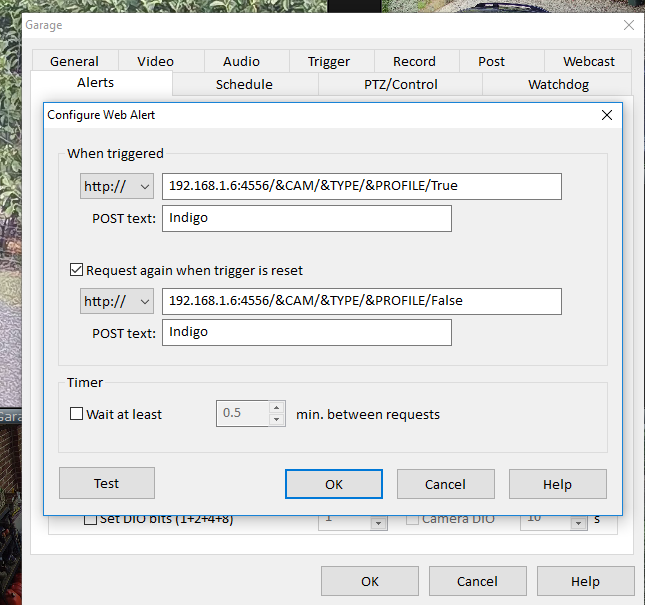
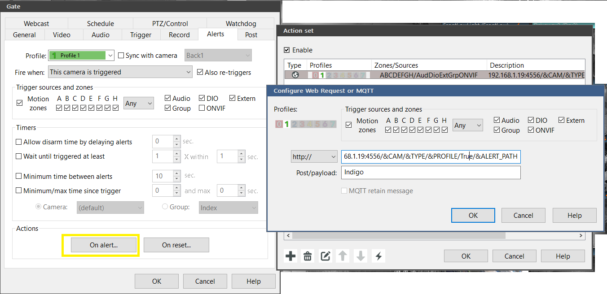
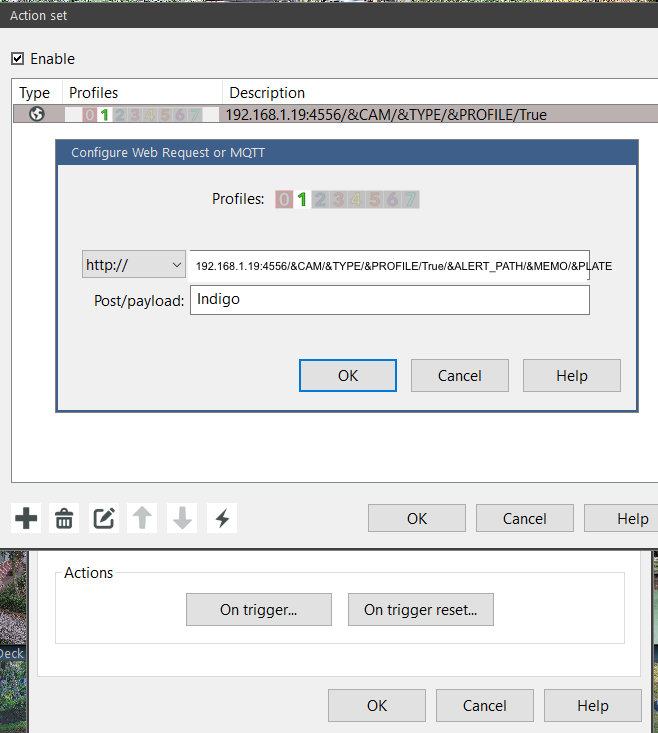
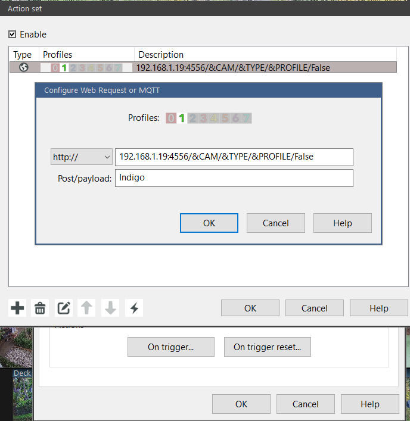

# Blue Iris Setup — Webhook URLs

The plugin receives motion events (and plate / AI alerts) via a tiny built-in HTTP server that Blue Iris calls like a web-service request.  You add a URL to each camera's **Alerts** tab in BI.

---

## Basic URL (5 segments — works for all features except ALPR)

```
http://<IndigoIP>:<PluginPort>/&CAM/&TYPE/&PROFILE/True/&ALERT_PATH
```

Replace `<IndigoIP>` with your Mac's LAN IP and `<PluginPort>` with the port from Plugin Config (default **4556**).

**Example:**

```
http://192.168.1.6:4556/&CAM/&TYPE/&PROFILE/True/&ALERT_PATH
```

### Trigger Reset URL

When you also want Indigo to know when motion **ends**, add a second URL for "when alert is reset":

```
http://192.168.1.6:4556/&CAM/&TYPE/&PROFILE/False/&ALERT_PATH
```

---

## Extended URL (7 segments — required for License Plate / ALPR triggers)

To pass the alert memo **and** the dedicated plate macro to Indigo:

```
http://<IndigoIP>:<PluginPort>/&CAM/&TYPE/&PROFILE/True/&ALERT_PATH/&MEMO/&PLATE
```

- `&MEMO` — the full alert memo string (may contain `plate:ABC123 95%` or similar AI text)
- `&PLATE` — BI's dedicated ALPR macro; expands to the bare plate text (e.g. `ABC123`)

**Example:**

```
http://192.168.1.6:4556/&CAM/&TYPE/&PROFILE/True/&ALERT_PATH/&MEMO/&PLATE
```

> Both `&MEMO` and `&PLATE` are optional BI macros — if BI does not have ALPR configured they expand to empty strings and the plugin ignores them gracefully.  The 5-segment URL continues to work unchanged.

---

## Where to Paste the URL in Blue Iris

### Blue Iris 4

1. Camera properties → **Alerts** tab
2. Under **"On alert"**, check **"Request from web service"**
3. Paste the URL into the **Address** box
4. In **Post text** enter `Indigo`
5. Check **"Request again when trigger is reset"** and paste the False-variant URL



### Blue Iris 5 — When Triggered

1. Camera properties → **Alerts** tab
2. Under **When triggered** → **"Make a web request"**
3. Paste the URL; set POST body to `Indigo`





### Blue Iris 5 — When Alert Ends

Add a second web request entry using the `False` variant of the URL:



---

## Blue Iris Plugin Server Settings

The plugin's HTTP listener port and server settings are visible in BI's plugin/server panel:


---

## URL Segment Reference

| Segment | BI Macro | Description |
|---------|----------|-------------|
| 1 | `&CAM` | Camera short name |
| 2 | `&TYPE` | Trigger type (MOTION, AUDIO, EXTERNAL, WATCHDOG, TEST) |
| 3 | `&PROFILE` | Active BI profile number |
| 4 | literal `True`/`False` | Motion start vs reset |
| 5 | `&ALERT_PATH` | Path to the clip/image that triggered the alert |
| 6 *(optional)* | `&MEMO` | Full alert memo (used for AI/ALPR text parsing) |
| 7 *(optional)* | `&PLATE` | Bare plate text from BI's ALPR engine |

---

## Testing the Connection

After saving the URL in BI, click the camera's **Test** button in BI.  Within a second you should see a `TEST` trigger fire in Indigo and the camera device's `lastMotionTriggerType` state update to `TEST`.
