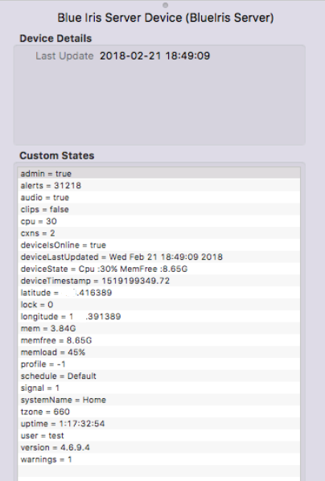
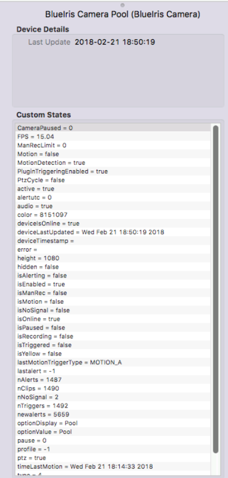
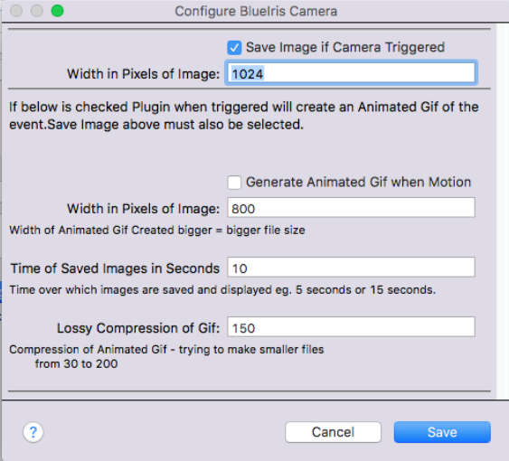
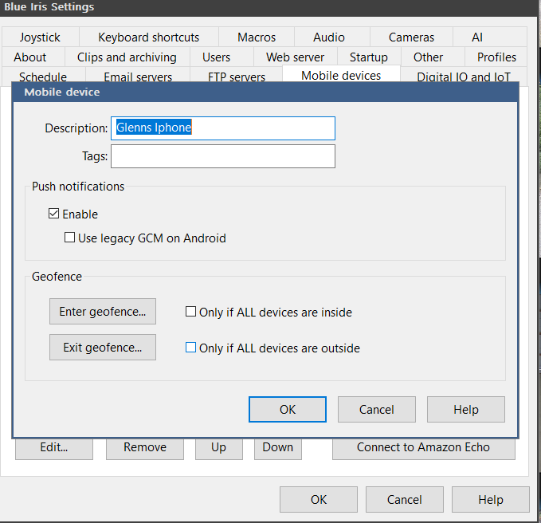
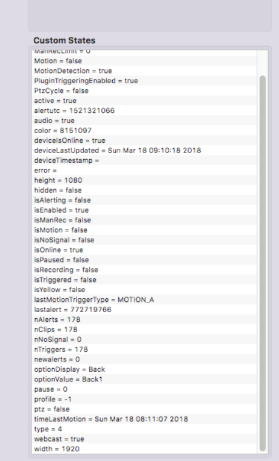

# Device Reference

The plugin creates four device types in Indigo:

| Device Type | One per… | Description |
|-------------|----------|-------------|
| **BlueIris Server** | BI installation | Server health, profile, schedule, disk |
| **BlueIris Camera** | Camera in BI | Motion state, recording, ALPR, full camera config |
| **BlueIris Device** | Mobile device / geofence node | Geofence inside/outside state |
| **BlueIris User** | BI user account | Login events |

---

## BlueIris Server Device

The server device tracks overall BI health and is created automatically when you click **Login / Generate Server Device** in Plugin Config.

### States

| State | Type | Description |
|-------|------|-------------|
| `cpu` | integer | BI server CPU usage % |
| `mem` | integer | Memory usage % |
| `memload` | integer | Memory load (MB) |
| `memfree` | integer | Free memory (MB) |
| `deviceState` | string | Overall device health summary |
| `deviceIsOnline` | bool | Whether the plugin can reach BI |
| `deviceLastUpdated` | string | Timestamp of last successful poll |
| `deviceTimestamp` | string | BI's own timestamp |
| `systemName` | string | BI machine hostname |
| `version` | string | Blue Iris version string |
| `admin` | bool | Whether the logged-in account has admin rights |
| `profile` | integer | Currently active BI profile (0–7) |
| `schedule` | string | Active schedule name |
| `uptime` | string | BI server uptime |
| `streams` | integer | Number of active streams |
| `clips` | integer | Total clip count |
| `clipsInfo` | string | Clip summary JSON |
| `alerts` | integer | Recent alert count |
| `warnings` | integer | Warning count |
| `disktotal` | string | Total disk size |
| `diskfree` | string | Free disk space |
| `diskused` | string | Used disk space |
| `diskallocated` | string | Allocated disk space |
| `diskname` | string | Disk label (e.g. `C:`) |
| `cxns` | integer | Current active connections |
| `audio` | bool | Audio enabled |
| `signal` | string | Signal status |
| `lock` | bool | Lock state |
| `tzone` | string | Server time zone |
| `latitude` | string | Geofence latitude |
| `longitude` | string | Geofence longitude |
| `softwareUpdate` | bool | True when a BI update is available |

---

## BlueIris Camera Device

One device per camera in BI.  Device name defaults to the BI camera display name.

### Camera Device Options

Each camera device has configurable options (set in the device's edit dialog):

### Key States

| State | Type | Description |
|-------|------|-------------|
| `optionValue` | string | BI camera **short name** (used in actions and URLs) |
| `optionDisplay` | string | BI camera display name |
| `Motion` | bool | `True` while BI reports the camera as triggered/in-motion |
| `MotionDetection` | bool | Whether BI motion detection is enabled for this camera |
| `isTriggered` | bool | Camera currently triggered (raw BI field) |
| `isMotion` | bool | Camera currently in motion state |
| `isRecording` | bool | Camera currently recording |
| `isManRec` | bool | Manual record active |
| `isPaused` | bool | Camera paused |
| `isEnabled` | bool | Camera enabled in BI |
| `isAlerting` | bool | Camera currently alerting |
| `isNoSignal` | bool | Camera has lost video signal |
| `isYellow` | bool | Camera in "yellow" (warning) state |
| `isOnline` | bool | Camera online |
| `active` | bool | Camera active |
| `hidden` | bool | Camera hidden in BI UI |
| `webcast` | bool | Webcasting enabled |
| `ptz` | bool | PTZ capable |
| `audio` | bool | Audio enabled |
| `isGroup` | bool | This is a BI camera group |
| `profile` | integer | Profile this camera is assigned to |
| `type` | integer | BI camera type code |
| `FPS` | integer | Frames per second |
| `width` | integer | Camera resolution width |
| `height` | integer | Camera resolution height |
| `color` | string | BI color label |
| `nClips` | integer | Number of clips |
| `nAlerts` | integer | Number of alerts |
| `nTriggers` | integer | Number of triggers |
| `nNoSignal` | integer | No-signal event count |
| `newalerts` | integer | New alerts since last check |
| `alertutc` | integer | UTC timestamp of last alert |
| `lastalert` | string | Last alert description |
| `PtzCycle` | bool | PTZ cycle active |
| `CameraPaused` | bool | Camera is paused |
| `ManRecLimit` | integer | Manual record limit (minutes) |
| `motionUTC` | integer | UTC timestamp of last motion event |
| `lastMotionTriggerType` | string | Type of last motion trigger: `MOTION`, `AUDIO`, `EXTERNAL`, `WATCHDOG`, `TEST` |
| `triggeredbyLog` | bool | Last trigger came from BI log polling |
| `PluginTriggeringEnabled` | bool | Whether plugin-level trigger processing is enabled for this camera |
| `pause` | bool | Pause state |
| `error` | string | Error string from BI |
| `deviceIsOnline` | bool | Indigo-side online state |

### License Plate States (v1.3.50+)

| State | Type | Description |
|-------|------|-------------|
| `lastPlate` | string | Most recently detected plate text (normalised: uppercase, no dashes/spaces) |
| `lastPlateConfidence` | integer | Confidence % for `lastPlate` (0–100) |
| `lastPlateTime` | string | Timestamp when `lastPlate` was set |

---

## BlueIris Device (Geofence / Mobile)

Tracks mobile devices configured in BI for geofence monitoring.

| State | Description |
|-------|-------------|
| `id` | Device identifier |
| `name` | Device display name |
| `inside` | `True` when the device is inside the BI geofence |
| `date` | Last geofence update timestamp |
| `push` | Push notification state |
| `count` | Event count |
| `type` | Device type string |

---

## BlueIris User Device

Tracks BI user accounts and login activity.

| State | Description |
|-------|-------------|
| `username` | BI account username |
| `isOnline` | True while the user is actively logged in |
| `timeLastLogin` | Timestamp of last login |
