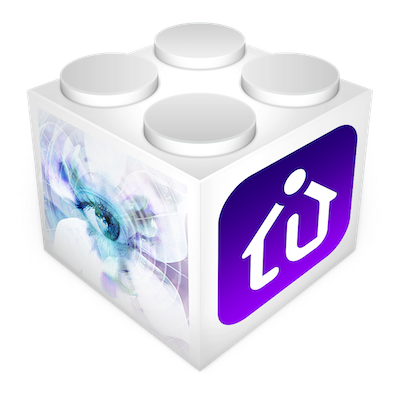

# BlueIris Indigo Plugin

Welcome to the BlueIris Indigo Plugin wiki. This plugin bridges [Blue Iris](https://blueirissoftware.com/) — the Windows camera-server software — with [Indigo](https://www.indigodomo.com/), giving you full two-way control and automation of your security cameras.

---

## Quick Navigation

| Topic | Description |
|-------|-------------|
| [Installation](Installation.md) | Download, install, first login |
| [Blue Iris Setup](Blue-Iris-Setup.md) | Webhook URLs to paste into BI per camera |
| [Plugin Configuration](Plugin-Configuration.md) | Plugin preferences reference |
| [Device Reference](Device-Reference.md) | All device types and their states |
| [Actions Reference](Actions-Reference.md) | Every action and its options |
| [Triggers Reference](Triggers-Reference.md) | Every trigger event and its config |
| [Animated Media](Animated-Media.md) | WebP, GIF, HEIF and MP4 creation |
| [License Plate / ALPR](License-Plate-ALPR.md) | Automatic plate recognition setup |
| [Changelog](Changelog.md) | Major version history |

---

## What the Plugin Does

- Creates an **Indigo device** for the BI server (CPU, memory, disk, profile, schedule)
- Creates an **Indigo device per camera** with live motion state, recording state, plate data, and 30+ states
- Fires **Indigo triggers** on motion on/off, AI tags, license plates, login events, geofence, log messages, disk space, and software updates
- Exposes **Indigo actions** for PTZ control, macro/profile changes, image capture, animated WebP/GIF/HEIF/MP4 generation, and more
- Runs a built-in **HTTP listener** (default port 4556) that BI calls with `&CAM/&TYPE/&PROFILE/…` webhook URLs — no variable subscriptions needed

---

## Version

Current release: **1.3.50**

Supports Indigo 2023.x / 2025.x and Python 3.10+.
