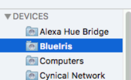
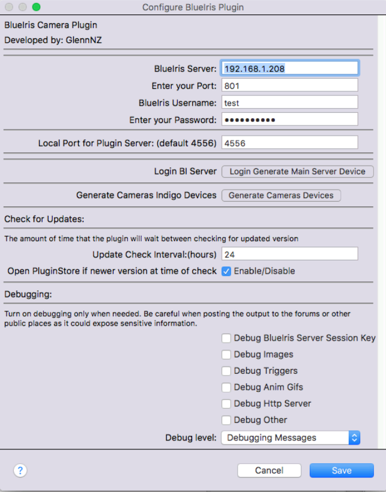
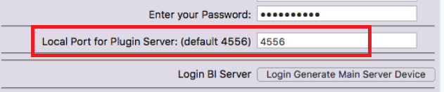
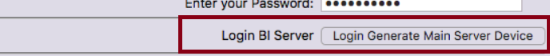
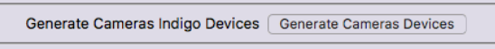
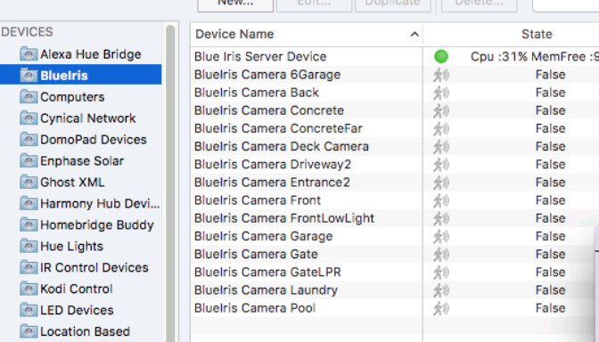
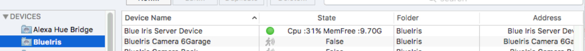

# Installation

## Requirements

| Item | Requirement |
|------|-------------|
| Blue Iris | Version 4 or 5 (Windows, on your LAN) |
| Indigo | 2023.x or later (macOS) |
| Python | 3.10+ (bundled with modern Indigo) |
| Network | Indigo Mac must reach BI's web server port |

---

## Step 1 — Download & Install

1. Download `BlueIris.indigoPlugin` from the [Indigo Plugin Store](http://www.indigodomo.com/pluginstore/149/) or from GitHub releases.
2. Double-click the `.indigoPlugin` bundle — Indigo opens an install/upgrade dialog.
3. Click **Install** (or **Upgrade** if you have a previous version).
4. The plugin appears in **Plugins ▸ BlueIris**.

---

## Step 2 — Create a Save Folder

The plugin saves images, animated WebP/GIF/MP4 files, and clip lists to a local folder.  Create one before configuring:

Suggested path: `~/Documents/Indigo-BlueIris/`  You can use any path; it is set in Plugin Config.

---

## Step 3 — Open Plugin Config

Go to **Plugins ▸ BlueIris ▸ Configure…** and fill in the server details:

| Field | Description |
|-------|-------------|
| BI Server IP | LAN IP of your Windows Blue Iris machine |
| BI Web Port | Port Blue Iris listens on (default `81`) |
| Username | A BI user account (admin for full PTZ/config actions) |
| Password | Password for that account |
| Plugin HTTP Port | Port the plugin's built-in listener uses (default `4556`) |
| RTSP Port | BI's RTSP port (default `554`) — used for MP4 recording |
| Save Directory | Path to the folder you created above |

Set the listener port:

Then click **Login / Generate Server Device**:

---

## Step 4 — Generate Camera Devices

After a successful login the **Generate Cameras** button appears:

Click it — the plugin queries BI and creates one Indigo device per camera:

The main BI Server device also appears in Indigo:

---

## Step 5 — Set Up BI Webhooks

See [Blue Iris Setup](Blue-Iris-Setup.md) for the URL to paste into each camera's alert settings so BI notifies Indigo of motion events.

---

## Upgrading

Double-click the new `.indigoPlugin` file and choose **Upgrade**.  All devices and settings are preserved.  Check the [Changelog](Changelog.md) for any post-upgrade steps.
