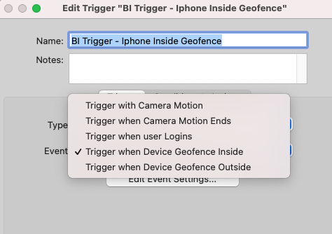
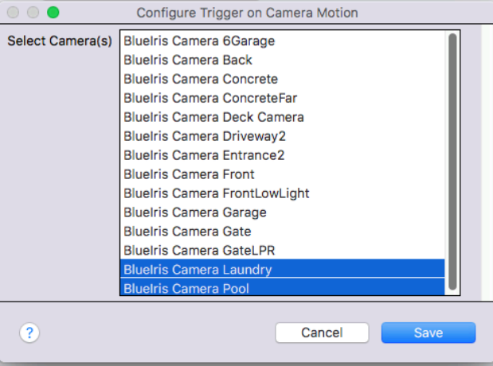
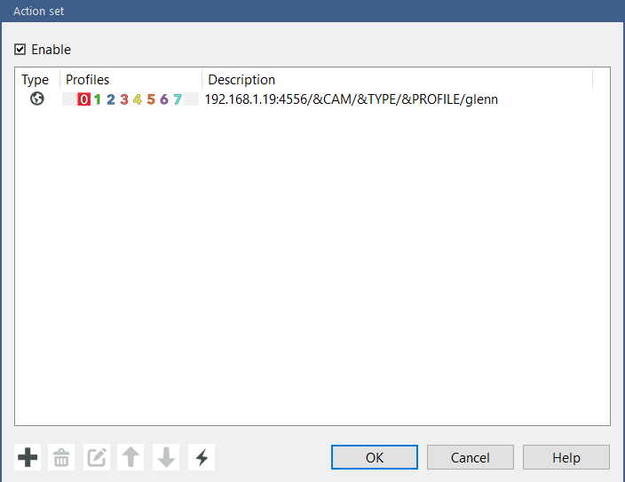
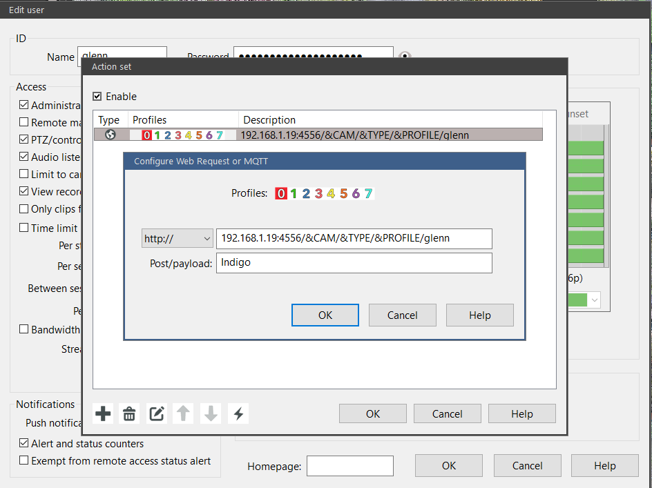
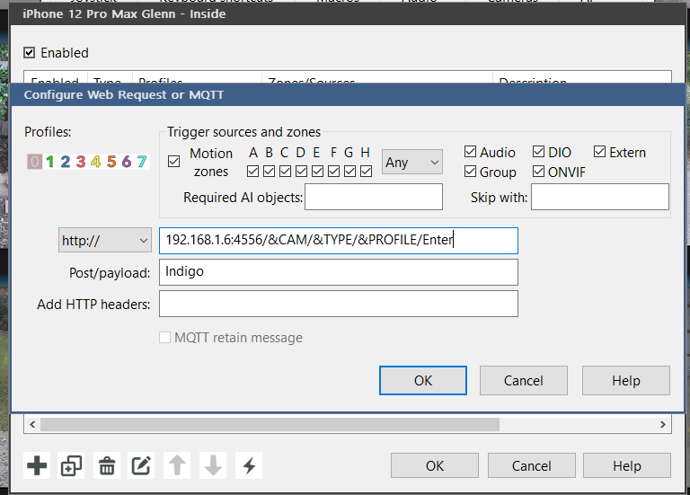
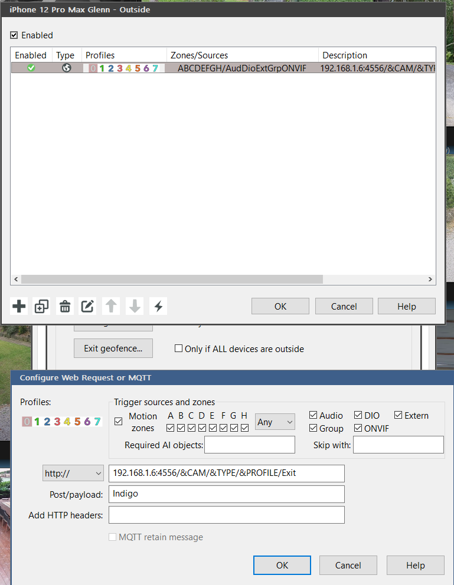

# Triggers Reference

Indigo triggers appear under **Triggers ▸ Event ▸ Plugin ▸ BlueIris**.

---

## Motion Triggers

### Trigger with Camera Motion
**Event ID:** `motionTriggerOn`

Fires when one of the selected cameras starts a motion event.  The camera device's `Motion` state becomes `True`.

**Config:**
- **Camera(s)** — select one or more BlueIris Camera devices (multi-select)

**Related states set on the camera device:**
- `lastMotionTriggerType` — `MOTION`, `AUDIO`, `EXTERNAL`, `WATCHDOG`, or `TEST`
- `motionUTC` — UTC epoch of the trigger

---

### Trigger when Camera Motion Ends
**Event ID:** `motionTriggerOff`

Fires when the motion event ends (BI sends the False webhook, or the plugin's 30-second auto-reset timer fires).  The camera device's `Motion` state becomes `False`.

**Config:**
- **Camera(s)** — select one or more BlueIris Camera devices

---

## User / Login Triggers

### Trigger when user Logins
**Event ID:** `loginUserTrigger`

Fires each time a specific BI user logs into the Blue Iris web interface.

**Config:**
- **Username** — select from the list of known BI users

---

## Geofence Triggers

### Trigger when Device Geofence Inside
**Event ID:** `geoFenceDeviceInside`

Fires when a mobile device enters the BI geofence zone.

**Config:**
- **Device** — select from the list of known BI mobile devices

---

### Trigger when Device Geofence Outside
**Event ID:** `geoFenceDeviceOutside`

Fires when a mobile device leaves the BI geofence zone.

**Config:**
- **Device** — select from the list of known BI mobile devices

---

## Log / AI Triggers

### Trigger on BI Log Message (by category)
**Event ID:** `logMessageTrigger`

Fires when BI publishes a log message matching the selected category (polled from BI's log endpoint).

**Config:**

| Field | Description |
|-------|-------------|
| BI log category | `Any level`, `Motion trigger`, `AI Alerted`, `Alert canceled`, `Connection/Login/Logout`, `Web request`, `Warning`, or `Error` |
| Text filter | Optional substring the message must contain (blank = any) |

---

### Trigger on AI Tag (person/vehicle/plate/…)
**Event ID:** `aiTagTrigger`

Fires when BI's AI engine tags an alert with a specific keyword.

**Config:**

| Field | Description |
|-------|-------------|
| Tag keyword | Case-insensitive tag (e.g. `person`, `vehicle`, `animal`, `plate`) |
| Camera(s) | Limit to specific cameras (none selected = any camera) |

---

## License Plate / ALPR Triggers

See [License Plate / ALPR](License-Plate-ALPR.md) for full setup instructions.

### Trigger when License Plate Detected (any plate)
**Event ID:** `plateFound`

Fires whenever any license plate is detected by BI's ALPR engine, regardless of which plate it is.

**Config:**

| Field | Default | Description |
|-------|---------|-------------|
| Camera(s) | any | Limit to specific cameras (none = any camera) |
| Minimum confidence % | `0` | Only fire if the ALPR confidence meets this threshold |

**States updated on the camera device:**
- `lastPlate` — detected plate text (uppercase, normalised)
- `lastPlateConfidence` — confidence % (0–100)
- `lastPlateTime` — detection timestamp

---

### Trigger when License Plate Matches
**Event ID:** `plateMatch`

Fires when the detected plate matches one of a user-supplied list.

**Config:**

| Field | Default | Description |
|-------|---------|-------------|
| Plates | — | Comma- or space-separated list of plates to watch for (e.g. `ABC123, XYZ789`) |
| Match mode | `exact` | `exact` — full plate match; `prefix` — plate starts with; `contains` — plate contains |
| Camera(s) | any | Limit to specific cameras |
| Minimum confidence % | `0` | Minimum ALPR confidence to fire |

Matching is case-insensitive and ignores dashes and spaces (`ABC-123 == ABC123 == abc 123`).

---

## System Triggers

### Trigger when Camera Loses Signal (No Signal)
**Event ID:** `cameraNoSignalTrigger`

Fires when a camera's `isNoSignal` state becomes `True`.

**Config:**
- **Camera(s)** — select one or more cameras

---

### Trigger when Blue Iris Software Update Available
**Event ID:** `softwareUpdateTrigger`

Fires once when BI first reports an available software update (state transitions from no-update → update available).  No configuration required.

---

### Trigger when BI Disk Free Below Threshold
**Event ID:** `diskFreeBelowTrigger`

Fires when the free disk space on a monitored drive drops below a threshold.

**Config:**

| Field | Default | Description |
|-------|---------|-------------|
| Disk name | blank | Drive label to watch (e.g. `C:`, `G:`).  Blank matches any disk |
| Threshold (GB) | `50` | Fire when free space drops below this value |
